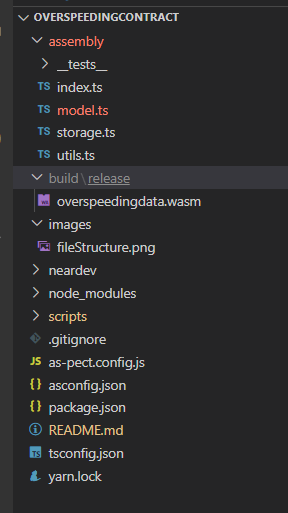

# OverSpeeding Vehicle Data Contract

This contract is designed to receive data from an IOT device
The goal is to prototype, how IOT can interface with blockchain
NEAR protocol provides an easy to use layer that allows for the two worlds to co-exist. I beleive both will have impact in our near futures.

## Setup

- Clone this repo
- Run `yarn`

## Usage
Some variables are expected to be set to use contract. 
Variables for CONTRACT, OWNER, VEHICLEID and CAMERAID.

Scripts are available with hints on data to enter for variables.

- Environment
  ```sh
  export CONTRACT=        # depends on deployment
  export OWNER=           # any account you control

  # for example
  # export CONTRACT=dev-1615190770786-2702449
  # export OWNER=<youraccount>.testnet
  ```

- Commands

Typically run script commands in order of numbers

  _Usage Scripts_

  ```sh

  1.dev-deploy.sh         # cleanup, compile and deploy contract
  2.call-set-speed-data.sh # enters inital speed data , speed data should be edited for varied entries on subsequent runs
  3.get-all-apeed-data.sh  # returns all speed data details associated with Contract details it is deployed to.
  4.get-vehicle-data.sh  # returns Vehicle specific data assosicated with Contract
  5.get-camera-data.sh  # returns Camera specific data associated with Contract
    
```
# File Structure



# Contributors

 	


